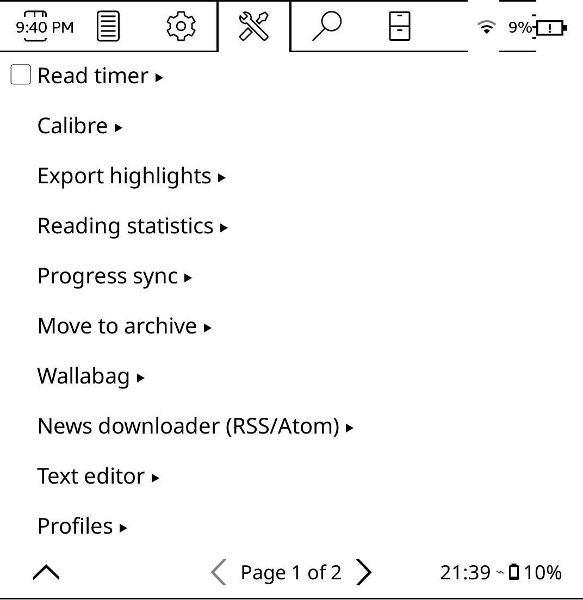
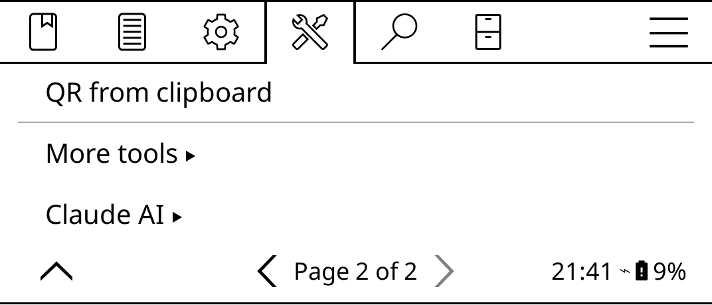
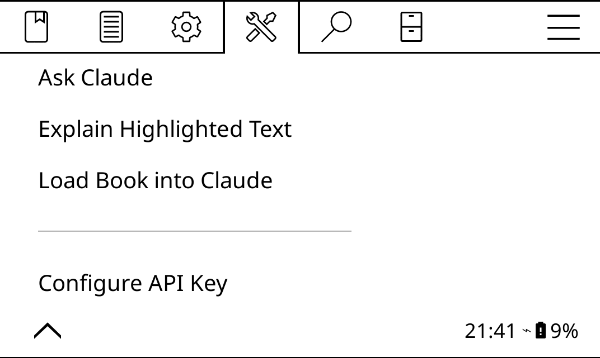

# Claude AI – KOReader Plugin

A KOReader plugin that integrates **Anthropic's Claude AI** directly into your e-reader.  
Highlight any word, name, or sentence and instantly get an explanation — or ask Claude questions about the entire book you're reading.

---

## Features

- **Highlight → Explain** — long-press any word or sentence and tap **Ask Claude** to get an instant explanation, translation, or biography
- **Ask Claude** — open a search-style dialog and ask any question about the book you're reading
- **Load Book into Claude** — let Claude read the full book so it can give accurate, context-aware answers
- Works with EPUB, PDF, and most other formats supported by KOReader

---

## Requirements

- KOReader (any recent version)
- An Anthropic API key → get one at [console.anthropic.com](https://console.anthropic.com)

---

## Installation

### 1. Download

**Download the ZIP file** on this page, then extract the ZIP file.  
You should see a folder called `claude.koplugin`.

### 2. Configure your API key

Open `claude_config.lua` in any text editor and paste your API key:

```lua
return {
    api_key = "sk-ant-...",   -- paste your key here
}
```

You can also set the key directly on the device after installing (see below).

### 3. Copy to your device

Copy the entire `claude.koplugin` folder into the **plugins** folder of your device:


### 4. Restart KOReader

Restart the app. The plugin loads automatically.

---

## Finding the plugin on your device

Open the KOReader main menu:



Go to **Tools** and tap **Claude AI**:



The plugin submenu:




---

## How to use

### Explaining a word or sentence

1. Open a book
2. Long-press a word or drag to select a sentence
3. Tap **Ask Claude** in the highlight popup

Claude will explain it based on what it is:
- **A person's name** → short biography or character description
- **A place name** → description of the location
- **An unknown word** → definition and translation
- **A passage** → meaning and context explained in plain language

### Asking questions about the book

1. Open a book
2. Open the menu → **Claude AI** → **Ask Claude**
3. (Optional but recommended) tap **Load Book** first so Claude reads the full content
4. Type your question and tap **Ask**


---

## Privacy

Your API key is stored locally on the device.  
Book text is sent to Anthropic's API only when you actively request an explanation or ask a question. Nothing is sent automatically.

---

## License

MIT License — free to use, modify, and share.
